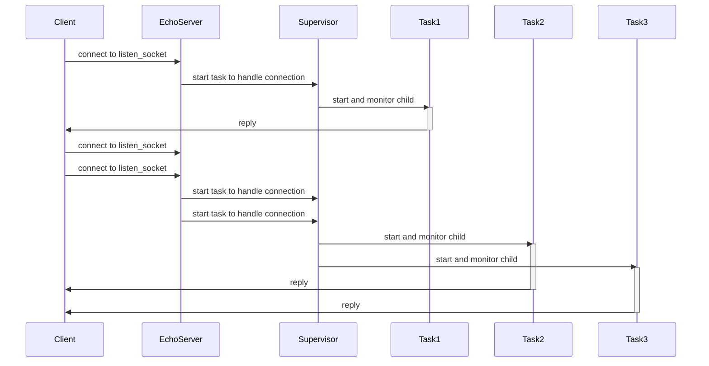

# ProtoHackers

Just fooling around with a couple of these challenges: https://protohackers.com/problems

More info and nice walkthroughs from Andrea Leopardi can be found here too: https://andrealeopardi.com/posts/protohackers-in-elixir/

## Process Interactions

